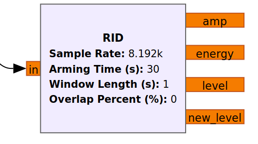

### Daren Swasey's Coding Portfolio

Howdy! I am Daren Swasey, currently a graduate student at Utah State University. I am working on a Master's Degree in Electrical Engineering with an emphasis in Controls and Signal Processing. Last year in the beginning of my program, I held a job as an undergraduate researcher in signal processing under Dr. Todd Moon. In that research I used MATLAB for designing and testing algorithms. I used Python and C++ for implementing the algorithms in custom GNU Radio blocks. Currently I am working for Dr. Greg Droge as a graduate research assistant. I have learned to develop components of the ROS2 framework for a simulation environment utilized for testing UAV path planning under uncertainty. I have become more familiar with real-time programming practices mostly in C++, but a little bit in Python as well.

I have been coding since my middle-school years, dabbling in C# briefly before moving on to C++ in high-school. Since then, I have grown to learn Python, Java, C, MATLAB, Assembly, VHDL, Verilog, and some Bash scripting. I have a few years of experience with Linux and Git VCS as well, rounding off some good software development skills that I have learned over the years in my EE degree and from the classes I took in my Computer Science Minor. Way before then, my experiences as a member of a FIRST Robotics programming team and what I learned from playing with LEGO Mindstorms set really showed me the potential of what can be done with code and hardware combined. I have been coding and learning how to code better ever since.

Below, I would like to showcase a few things I have done over the years.

## Other Notable Projects
There's a lot of stuff I have done over the years with code, and I would like to make mention of a few of them here.

### GNU Radio Multi-Antenna Real-Time Data Flow System for Indoor Geolocation via Machine Learning with Rincon Research Inc.
For an internship in the summer of 2022 at Rincon Research, I had the opportunity to learn how to develop a real-time system with the GNU Radio ecosystem. I worked alongside five other interns with experience in signal processing, machine-learning, web-development, and Linux administration. In part of my work, I developed a method of synchronizing incoming data from 2 USRP B210 radios linked to separate computers. I utilized the ZMQ library in Python with a TCP protocol for message transmission between computers on the same network. A server-side desktop received the data from both radios and fed it through a neural network to get predictions about the location of a radio transmitter. These prediction outputs were then stored in JSON files to be sent to a web client that would display the data. The goal for the system was to operate at around 5 Hz in real-time and I was able to achieve that design goal.

### GNU Radio Multi-Antenna Real-Time Intrusion Detection System
In March of 2021, I began work with Dr. Todd K. Moon, a professor at USU who teaches primarily signal processing classes. At the time, I was tasked with the goal of what amounted to an indoor "burglar alarm" that ran off of radio signals and software-defined radios (SDRs). After a grueling process of study, research, testing, failing, testing, progress, and more testing, I was able to come up with several algorithms for intrusion detection. These algorithms ran in the GNU Radio environment in sort of a pseudo-real-time fashion, and the results were actually quite surprising in a positive way. Check out my video from GRCon [here](https://www.youtube.com/watch?v=JcKWgyM55To&t=1s). It's funny how much work went into this block. It can now be dragged from a menu in two seconds, but it took 5 months to make.

### STM32L476VGTx Audio Recorder and Playback System
This was a very challenging project to put together. It was created as a final project for a Microcontrollers class at USU. This little system used an on-board microphone in combination with a small piezo-electric speaker to record and play back audio. It was definitely low quality, but the point it that it worked. It took long hours of pouring over the massive datasheet for the STM32L476 finding all the correct bits to set, figuring out how to make an intuitive menu with a limited 7-segment LCD screen. It had features like playing in reverse, changing the speed and volume of playback, and of course, recording. It was a pretty fun little project!

### Some Smaller Class Projects or Personal Projects
- Sudoku puzzle generator and solver (C++)
- Binary search trees, balancing binary trees (C++, Java)
- Completely software-based QPSK transmitter and receiver. Included my own code for PLL, TED, cubic interpolation using a Farrow filter, and complex signal symbol decision. (Python)
- Software-based Synthetic Aperture Radar (SAR) algorithms for generating radar-based images (Matlab)
- UART communication on FPGA (Verilog)
- Basic CPU scheduling algorithms, page replacement, multi-threaded task completion (Java)
- Simple VGA display via FPGA (VHDL)
<!--
**dswasey9608/dswasey9608** is a ✨ _special_ ✨ repository because its `README.md` (this file) appears on your GitHub profile.

Here are some ideas to get you started:

- 🔭 I’m currently working on ...
- 🌱 I’m currently learning ...
- 👯 I’m looking to collaborate on ...
- 🤔 I’m looking for help with ...
- 💬 Ask me about ...
- 📫 How to reach me: ...
- 😄 Pronouns: ...
- ⚡ Fun fact: ...

Outline:

- Short intro to myself
- Backstory of how I came to be an EE and software developer
- List of skills and favorite things to do in code
- List of my favorite projects
  - Show images of the absolute best
  - Keep images of others in a folder on GitHub
-->
