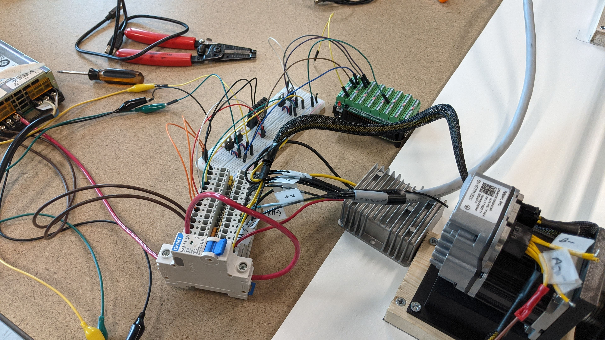
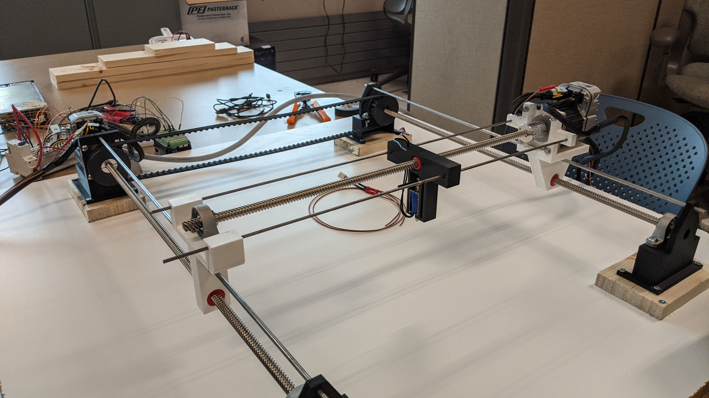

**Table of Contents**
- [Summary](#summary)
- ["2D Printer"](#2d-printer)
  - [Circuitry](#circuitry)
  - [3D Printed Parts](#3d-printed-parts)
  - [Image Processing](#image-processing)
  - [Path Generation](#path-generation)
  - [Video Link](#video-link)
- [Minimum Distance Optimal Control of Robotic Manipulator](#minimum-distance-optimal-control-of-robotic-manipulator)
- [Simplified Tetris](#simplified-tetris)
  - [Video Link](#video-link-1)
- [Conway's Game of Life](#conways-game-of-life)
  - [Video Link](#video-link-2)
- [STM32L476VGTx Audio Recorder and Playback System](#stm32l476vgtx-audio-recorder-and-playback-system)
  - [Video Link](#video-link-3)

# Summary
This page showcases some of the things I have done for school and for personal projects. I have
worked with a large variety of systems, languages, and tools over the course of my education. Each
new experience brought its challenges, but I always had fun in the end. 

# "2D Printer"
<!-- insert image of 2D printer results -->

"Plotter" is definitely the common name for this, but I wasn't aware of it until I did some more 
research. For the Mechatronics class at USU, the main objective of the class was to design and build 
a project of your own choosing. My team included myself and two mechanical engineers. 

To summarize:
- Utilized a BeagleBone Black Microcontroller
- Made edge detection, path tracing, and path following code from scratch.
- It worked. It also happened to make some really cool images. Below is one that I came up with and 
plotted using some assets I found online.

<!-- Show the LotR image -->

This project required the development of analog circuitry to control servos that moves the drawing 
utensil around the plotting space, power considerations, 3D printing, image processing, simple path 
planning, and plenty of programming.

The flow of the system was intended as follows:
1. Do edge detection on an image to extract the edges to draw.
2. Store the edge detection and generate paths for the plotter to follow as it drew the image
3. Convert pixel map data to servo commands
4. Iterate through the commands to draw an image.

The machine was able to produce some simple but quite amazing drawings, even considering how much
work still could have been done to improve its operation.

## Circuitry
The circuits developed were rather simple. The Teknic ClearPath servos needed a direction and a step input from a
3.3V logic-level driver. I wired up a low-side NPN transistor configuration for each input, one set
for the x-axis, and one set for the y-axis. The actuation for the drawing utensil was operated in a 
similar way, using a flyback diode to prevent back-EMF into the power supply. The motors were driven
using a BeagleBoneBlack (BBB) microcontroller, which also hosted the code for image processing and generating
path commands.

## 3D Printed Parts
The 3D printing was done by my team members. Mounts for the servos were created using CAD models of
the servos from Teknic. Brackets and other mounts for stabilization of the two lead screws were also
printed, as well as a pulley for the belt used for transferring rotational motion from one x-axis
screw to another. Many of the mechanical concerns that were addressed came in trying to make sure
everything on the machine would be aligned and not tear itself apart.

## Image Processing
Originally the idea was to be able to read in an image like a PNG or JPEG and do Sobel edge detection
on it, but I quickly realized that I didn't quite have the resources to read in a full image in those
file formats. I instead utilized a MATLAB script I had written for a Discrete-time Systems and Signals
class that converted those types of images into bitmaps, which were much easier to read in code.
I wrote code for Sobel edge detection that was verified to work, but unfortunately Sobel edge-detection
didn't really get the fine-grained lines that I was looking for, even though I put a threshold on
them to really make sure I only got the most distinct lines.

Unfortunately due to time-constraints at the end of the semester for this project, I had to pre-make
images to run path generation on, but for proof-of-concept purposes, the whole process of the project
still "worked".

## Path Generation
The path planning for this device was really the first I had ever tried to do, and I didn't have
any prior knowledge for how to generate paths for a plotter beforehand. What I came up with essentially
amounted to what one could imagine as a Roomba-style cursor on an image. It would start at the
top-leftmost active pixel from a processed image, then look at the first active pixel neighbor
in the bitmap in a clockwise direction from the current direction it was facing. Once an active pixel
was travelled to, it would be marked as inactive (0 for inactive, 1 for active on a black and white
bitmap). 

The differences in location from pixel to pixel would be recorded with the appropriate step and 
direction commands into a path. This would continue until there were no longer active neighbors of
the "scanner" as I called it, then each path was stored in a vector. The vector of paths, or servo
commands, would then be read and the signals transmitted via the GPIO pins on the BBB.

The biggest issue in this part of the process (already acknowledging that the path generation is not
the most amazing algorithm) was the lack of ability to control servos simultaneously and the inability
to directly access the GPIO pin values from the BBB. I was only able to manage control using system
commands, which were exceedingly slow and disappointing when trying to actually draw something.

## Video Link
A demonstration of the plotter can be viewed [here](https://youtu.be/AMiA-ovaab8). The first little
bit of the video is just a slideshow of some of the results. The video of the system working start
at the 30-second mark. You may notice that video portion is actually sped up. It gives you a sense
of how absurdly slow the commands were being updated on the BBB.

# Minimum Distance Optimal Control of Robotic Manipulator
<!-- Highlight efforts made and what I learned -->
This project was the last project I worked on as part of earning my Master's degree. The design goal
was to move a robotic manipulator end-effector from one point to another in a straight line. I 
learned how to derive simple forward kinematics for robotic manipulators for this which was quite fun.
One can feel pretty powerful once one learns forward kinematics, being able to know any position of
any joint given the joint angles and distances of the robot! Unfortunately I was not able to complete
this project on time due to some struggles with the implementation methods I tried. I used a
optimal control toolbox called [OCS2](https://github.com/leggedrobotics/ocs2) for my initial attempt,
then switched to MATLAB for another attempt. Though neither successfully satisfied the objective
due to lack of development time, I was still able to get part of the problem mostly working in `OCS2`.

The optimal control problem was developed originally as a Bolza problem, and manipulated slightly
to operate within the framework of the tools I used to attempt to implement the solution. The `OCS2`
implementation got the closest to looking like a real solution. The MATLAB implementation got nowhere
close.

The report I wrote regarding the results of the project can be found 
[here](../docs/school_personal/optimal_control_final_project.pdf). Be aware that the link to the
GitLab repository is inaccessible because the project was part of a larger hierarchy for which
I do not have the ability to change access permissions.

|                                                                           Image Descriptions                                                                         |                                    Image                                   |
|:---------------------------------------------------------------------------------------------------------------------------------------------------------------------|:--------------------------------------------------------------------------:|
| This image shows how I plotted the trajectories of each joint, which helps to make sense of all the visual information in the images below                           |  |
| This animation highlights the use of the kinematics I developed for the Trossen Robotics RX200 manipulator with a simple state-feedback controller                   |                  |
| This is the result of a simultaneous optimization in MATLAB using a code framework from an assignment in class. Didn't turn out too well.                            |      |
| This is the `OCS2` implementation and result, which actually generated a somewhat useful trajectory, but the optimization never got the arm all the way to the goal. |              |

# Simplified Tetris
<!-- Include information about interfacing with the accelerometer -->
This project was part of my *Reconfigurable Computing* class at USU. The final project for the class
was to use an Intel DE10-Lite FPGA development board to create a simplified Tetris game, with sound,
score, visuals, and some method of control. Because I was in the graduate version of the class, my
lab partner and I were required to interface with and use an accelerometer to control the location
of the falling block in the game. All code was written in `VHDL`. You can watch a video of the results
by clicking on "Video Link" below.

I spent a ridiculous amount of time working on the accelerometer control while my lab partner did most
everything else. I would have liked to work on more, but I just kept on running into issues with 
the accelerometer. Communication with the onboard accelerometer was achieved using the SPI protocol.
A driver for the low-level SPI communication was created, which passed information to a SPI "controller".
The SPI controller operated on 16-bit input and output data segments while the driver worked with
the individual bits. Only the x-axis data was necessary for the game controller to be implemented,
so that simplified the work a little bit.

The final product of the work on the accelerometer was a game controller that had a center deadzone
to reduce "noise" on the motion from the user. The tilting motion in the left or right direction
would move the block in that respective direction, and the block would persist in a given column
of the game map when the user returned the board to the neutral position within the established
deadzone.

The onboard accelerometer was an ADXL345 accelerometer, with the data rate set to 100 Hz.

## Video Link
A quick demo video can be seen [here](https://youtu.be/R3DakccRPjQ).

# Conway's Game of Life
<!-- Must include Sonic the Hedgehog recording somewhere in here -->
This was a really fun assignment I finished while taking a C++ class for my CS minor. Though the 
concept of Conway's Game of Life is rather simple, in the process of making the base requirements
for the assignment, I decided to go all out. 

The most obvious visual addition to the program in comparison to the original assignment 
requirements was the screen-wrapping. I just thought it would be fun to add, so I did. The second
feature addition was the timing. I updated the program to include a parameter for beats-per-minute (BPM)
in order to be able to update at a specific rate with respect to a selected song, since often the 
tempo of the song is presented in BPM. I ended up spending about 6 additional hours working on these
two features and for quite a fun result. I am a big fan of Sonic the Hedgehog and Saturday morning
cartoons, so what better song to sync up the action to than "Gotta Go Fast"? 

## Video Link
Check out what I did by following this [link](https://youtu.be/AwmLSysGSoA)!
|   |   |
|:-:|:-:| 
|   |    |

- Sonic X image by https://sonic.fandom.com/wiki/, Fair use, https://en.wikipedia.org/w/index.php?curid=62470745
- Conway's Game of Life example by Lucas Vieira - Own work, CC BY-SA 3.0, https://commons.wikimedia.org/w/index.php?curid=101736

# STM32L476VGTx Audio Recorder and Playback System
This was a very challenging project to put together in terms of learning new skills to tackle the 
actual problem. It was created as a final project for a Microcontrollers class at USU. This little 
system used an on-board microphone in combination with a small piezo-electric speaker to record and 
play back audio. It was definitely low quality, but the point is that it worked. It took long hours 
of pouring over the massive datasheet for the STM32L476 finding all the correct bits to set, 
figuring out how to make an intuitive menu with a limited 7-segment LCD screen. It had features 
like playing in reverse, changing the speed and volume of playback, and of course, recording. It was
a pretty fun little project! All of the code was written in C.

## Video Link
A simple example of this working can be found [here](https://youtu.be/cHCXgGVlyZ8).

<!-- Include a video link to this project -->