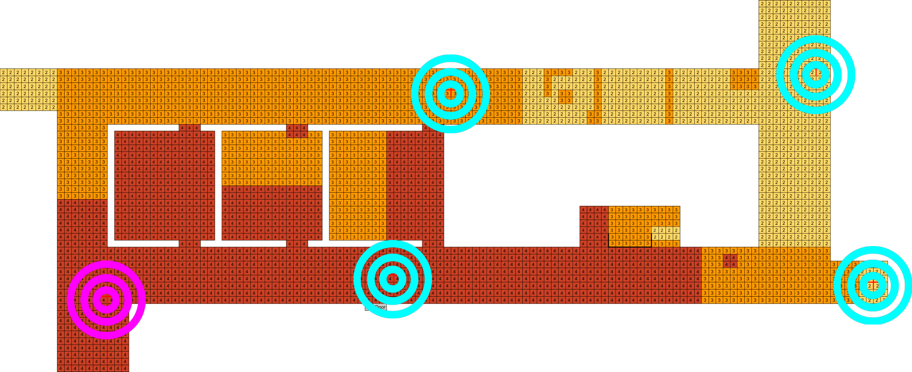
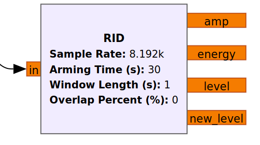

# Information Dynamics Laboratory (March 2021 - May 2022)
At the Information Dynamics Laboratory (IDL) at Utah State University, I worked under Dr. Todd K. Moon
and assisted in his research regarding Doppler signals for interior target tracking, where the 
target is not transmitting its own radio signal. This process began after I had taken a Discrete-time
Systems and Signals class at USU. In the class I had the opportunity to do use some basic but quite
amazing audio and image processing techniques. Whether it was learning about convolution, the Fourier
transform, signal modulation, or otherwise, it was all really intriguing. I then learned that Dr.
Moon had an open position on his team for research.

I started this research by becoming familiar with the basics of digital communications. BPSK, QPSK,
OFDM, and QAM signal types were all utilized during my time there. As I worked up from ground-zero
in my digital communications knowledge, I was able to start working with Dr. Moon to attempt to 
extract Doppler frequencies from an OFDM signal, relying on generated data to provide a steady OFDM
signal. 

Along the way, for a project leading up to the OFDM research, I also developed some tools
and algorithms to analyze incoming data of a QPSK signal on a multiple-antenna system in real-time.
The result of the analysis was the ability to detect motion almost anywhere in the 2nd floor of
the building I was working in using an array of four antennas. The results of this project can be
seen in my 2021 GRCon presentation, which was hosted in Charlotte, North Carolina.

- [Presentation Video](https://www.youtube.com/watch?v=JcKWgyM55To&t=1032s)
- [PDF of Technical Report](../docs/multi_antenna_detection.pdf)
- [Video Demonstration of Detections](https://youtu.be/onrUHqd5cPw)

As a TLDR, below is an image of the final result of that project. By using the gain value that
appears in an Automatic Gain Control (AGC) defined in software, I was able to identify when a 
non-transmitter was moving or had changed position. This held true for the nearly the entire floor of the 
building I was working in, assuming the target was going at a typical walking pace. The heat map
below shows where detections could be made. Warmer colors means more individual antennas were picking
up information indicating movement. The purple target indicates the QPSK transmitter location, and 
the blue targets indicate the locations of the receiver antennas.

This picture is of a drag-and-drop block in the GNU Radio software that did all the heavy lifting
for intrusion detection. RID stands for Real-time Intrusion Detection. It's funny how much work went
into developing something that now only takes a couple of seconds to put into a system...

Some of the main experiences I gained here include:
- Digital communications
- MATLAB signal processing
- GNU Radio
- Using Ettus Research Software Defined Radio tools and hardware
- Data collection and management (all would have been lost without organizing the many GB of data we collected)
- Developing C++ and Python code using 3rd-party libraries
- Technical writing
- Data analysis
