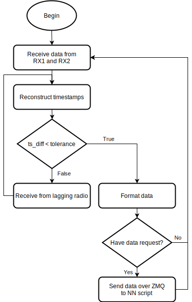

# Summer Internship at Rincon Research Corporation
I was privileged to go to Tucson, AZ to work as an intern in the summer of 2022. This was between
finishing my senior year of my undergraduate program at Utah State and starting my last year of my
graduate program (I was in a concurrent program, so got a bit of a fast track). I was selected along
with five others to participate. Three of us were in electrical engineering with a signal processing
background, and two were majoring in computer science. The last intern was actually still in high
school and was functioning as the IT guy for the rest of the interns. He did a fantastic job for not
having any prior experience with Linux or many IT-related skills.

The project us interns had the opportunity to work on was a machine-learning-based indoor geolocation
system. In other words, indoor GPS. For the purposes of our internship, we assumed that the target
to be tracked would have a radio transmitter (which I agree, is part of what GPS is, but the 
research direction was to be able to do it without a transmitter on the target. Thus, I bring it up).

The project was considered a success. By the end of the internship (two months), we were able to get 
a general position in the Rincon building of the transmitter, which could be displayed in real-time
at a rate of 5 Hz on a webserver. Were there a lot of problems still? Absolutely, but it goes to 
show how complex an indoor GPS can be.

You might be wondering, "what did this thing look like"? Well, not very exciting in a shiny and 
fancy new technology sort of way. Most everything was done over a wireless network since we needed
to plant Ettus Research radios across the first floor of the building we were working in. The processing
for the data was distributed between some workstation-esque laptops connected to each radio in use
and some desktops supporting the synchronization of data and porting some of that data to a webserver
for transmitter location display. In the end there were just two receivers and one transmitter. 
More receivers would usually mean better in a situation like this. For any machine-learning problem, 
extra data never seems to hurt, but we didn't have the time nor the resources to get more receivers
integrated into the system.

The key things I learned as part of this internship include:
- Network communication protocols
- GNU Radio capabilities (to add to what I began to learn at the [IDL](./idl.md))
- Needs for team goal setting and planning
- Digital spread-spectrum (DSS) communication
- Basic code profiling for system speed improvement

Below I will go over a few of the things that I worked on in this system.

## System Overview

Aside from a few things I will explain here, the diagram is fairly straightforward regarding the
process of data in to data out. The confusing part is probably the red arrows and the components
split onto the lower line. The red arrows indicate that a particular block is either completely
designed for real-time operation, or has a separate part of it designed specifically for a real-time
implementation. 

The components I played a role in developing are:
- The entirety of the contents of the first dotted box, all of which are part of GNU Radio
- Entirety of contents of second dotted box, the real-time GNU Radio components
- `Data Sync` block
- Real-time parts of the `File System` block

## PN Sequences and Raw Data Collection
I won't go into a lot of detail here, but for the interested reader, you can take a look at my
[end-of-internship report](../docs/rincon_report_signed.pdf) for more information.

A pseudo-noise (PN) sequence can be used in digital communications to spread out a signal across
the frequency spectrum, called a spread-spectrum signal. All the PN sequence is is a sequence of numbers
typically `2^n` in length, with random values. If those values were considered in the time-domain,
they would look very sharp. In the frequency domain, the power is spread across a huge range of
frequencies. What this accomplishes is pretty awesome. 
Usually in digital communications, engineers need to be concerned about the noise floor, or the 
power level of the random radio signals floating around in the air. If a particular signal is below 
the power level of the noise floor, it can be really difficult to pick up on the receiver side of 
the signal. However, with a spread-spectrum signal, as long as the receiver has the same PN
sequence to correlate incoming signals with, the transmitted data can be recovered.

I worked with a few of the other interns to set up a system in GNU Radio such that we could generate,
modulate, transmit, then receive, demodulate, and do correlations on the incoming signals on the 
receiver end. We used a simple BPSK (Binary Phase Shift Keying) modulation scheme.

## Real-time Operations
The goal for the system's real-time operation was to run at a rate of 5 Hz. In order to do this,
we had to consider the length of the PN sequence, the correlation's computation time, and data 
conversion for outputting to the rest of the system. We decided to use publisher/subscriber network
communication protocol in order to send received data through to the neural network to make an 
estimate of where the transmitter was at any given time.

The library we used to do this is called `ZMQ`. It provided a simple interface for us to connect to
different devices over a local WiFi network which we used to synchronize the whole system. We needed
training data to be collected so the neural network could be developed initially, meaning that when we
actually used the real-time component of the system, the data also needed to be time-synchronized. This
also required that we retain as much data as possible. This necessitated the use of TCP in our system,
so as to make sure that the correct sets of correlations were compared to each other. TCP uses 
two-way communication to verify that the subscriber has actually received the data before dropping
a given piece of data from the publisher's message buffers.

After sending correlation data using tools in the `ZMQ` library, we needed to do data synchronization.
Because of limitations on data types that we could send through the GNU Radio data pipeline, the timestamp
obtained for any given piece of correlation data needed to be split up and converted into multiple
limited bit-resolution numbers. This information was then send in the same vector of data that the 
correlations were stored in. The vectors of data were sent from the laptops connected to the receivers
to a desktop that did data synchronization.

The data synchronization algorithm looked something like this:

If one of the radios was sending data with timestamps too far ahead of the others,
receiving data from the radio that was ahead would be halted, while waiting for the other radio to
catch up. Once the timestamps for both of the radios are within a specified tolerance, the data was
formatted to be compatible with the neural network (labeled NN in the image). To make sure the neural
network could keep up, I implemented a server/client protocol. Whenever the neural network was ready
to process new data, it would make a request to the data synchronization node. This method of data 
transmission allowed the neural network to have the most recent data at any given time. 

The last part of the real-time system that I implemented was a simple script to convert output data
from the neural network into `JSON` files.

