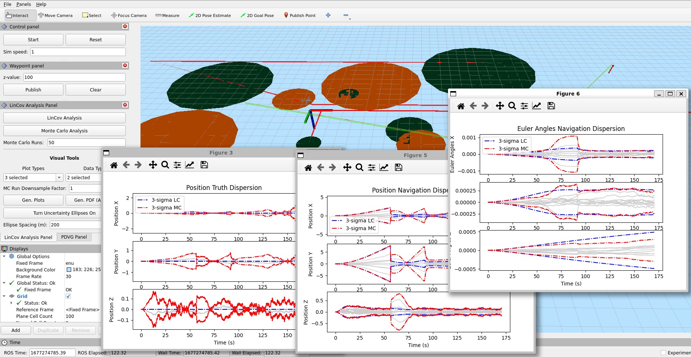
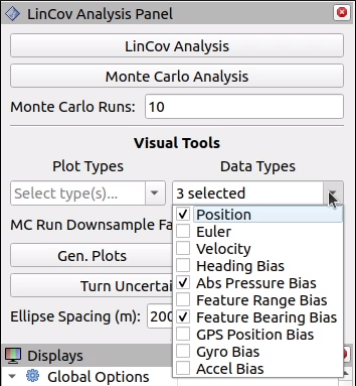
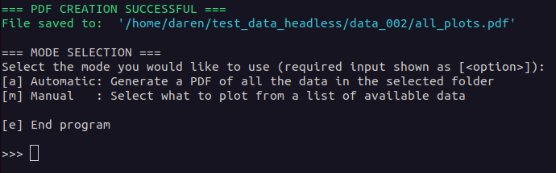
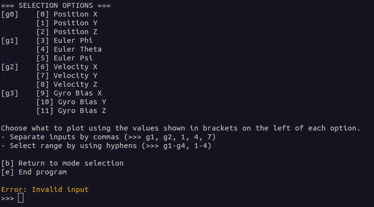
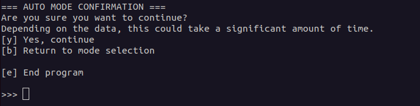
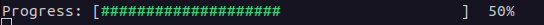

# Utah State University Robotics Lab (August 2022 - May 2023)
In the last year of my graduate program I had the opportunity to work with Dr. Greg Droge in his 
robotics lab at Utah State. I did a Master's of Engineering program for my grad program, so I took
more classes instead of focusing on research had I done a thesis. So when I worked for Dr. Droge I 
was mainly doing supportive coding work for a PhD student candidate regarding UAV path planning under
uncertainty. I was able to learn a lot of cool things regarding ROS2 and real-time communication
systems.

Below I will briefly describe some of the tools I developed while working here.

<!-- List of things I learned and developed -->
I was able to develop skills here in the following areas:
- ROS2
- C++
- Python
- QtGui
- Real-time operating systems and communication
- Large code workspaces
- Process of making merge requests using Git
- User menus

## Buoy Publisher
The Buoy Publisher was a simple ROS2 node that took in ROS parameters via a launch file setup, then
used those parameters to define location of "buoys" or "features" that the simulated UAV would detect
with one of its position sensors. The buoy publisher was utilized more for a visualizable version of a
simulation using a tool called `rviz`. Making this node was my introduction to many of the tools and 
features ROS2 uses. This includes their version of publishers and subscribers, ROS parameters,
launch files, package building, and making a usable ROS workspace.

The green and orange circles in the image below are both visualized by different versions of the 
buoy publisher.

## LinCov and PDVG Interfaces
The biggest nodes I created while working for Dr. Droge were the LinCov and PDVG interfaces. These
were developed as a wrapper for using code that did linear covariance analysis on the planned UAV paths,
or for the PDVG (Probability of Detection Visibility Graph) problem. The PDVG problem was a problem
being developed by one of Dr. Droge's PhD student regarding how to guide a UAV through a GPS-denied
region without being detected by local radars.

This node required me to connect user interaction from the `rviz` interface with certain features
of the LinCov analysis code. A large number of parameters were required to be passed in, along with
a fair amount of setup for publishers, subscribers, servers, and clients. Several of those communication
paradigms were used in order to synchronize actions between certain parts of the system. 

The biggest challenge in creating theses nodes was making them in such a way that the computers
that ran the simulation wouldn't run out of memory. The paths and data generated for a given UAV
trajectory took a ton of memory, so I had to implement parts of the data processing steps in such
a way that the memory usage was minimized. Whether this was operating on smaller chunks of the data
multiple times or being more explicit about the scope of certain parts of the data, I went from seeing
memory usage double in some places to only being about 1.25 times the amount of original memory usage.

The operations here were all initiated by an `rviz` panel plugin which I also created.

### RVIZ Plugins
The `rviz` plugins were made to add panels to `rviz` that allowed the user to call certain processes
for the LinCov or the PDVG problem. Different pieces of information to plot, different analyses to
run, or certain visual components to turn on or off. These plugins made heavy use of the QtGui library,
thereby using their signal/slots paradigm to communicate information from user actions to the code
that did the heavy lifting. The panel I created is shown below.

The most challenging part of this tool was ensuring that the user couldn't lock the system into a 
certain state or make it crash, which was surprisingly easy to do. I've learned that user interfaces
take so much more work than I originally thought to provide robust performance. 

### Plotting Tools
The last part of the functionality that was implemented for the LinCov and PDVG interface nodes was
the plotting. There was originally some functionality for plotting that used a C++ implementation of
`matplotlib` but it really didn't work well for what we needed. The goal was to be able to plot
data and continue running a simulation, but `matplotlib` was using a blocking call, preventing that
from happening. I reworked the plotting, adding a Python script that utilized multi-processing
in order to keep the simulation going while simultaneously being able to view and manipulate plots.
The data was saved off as in CSV files, and then the Python script grabbed those and plotted the data
from there.

## Headless Simulations
One of the later tools I developed was a headless simulation, i.e. running simulations and collecting
data without the use of RVIZ. This required connecting all the different services, topics, publishers
and subscribers, and using them in the proper sequence. I carefully looked at the events that happened
in order to run a simulation in RVIZ, then slowly pieced those together in a simulation manager node.

Making a tool like this allowed the team to collect data on a separate computer while minimizing
the resource usage of that computer. That meant that data could be collected from multiple simulations
at the same time.

### Headless Plotting
I made another plotting tool for the data for headless simulations to use as a verification tool and
obviously as a way of making plots for sets of data that matter. It was another Python script. My
favorite part of this was developing a menu such that both interactive plots and a PDF version of the
plots could be created. Having both actually turned out to be really handy.

The images below show a little bit of what I had implemented as far as a menu goes. I was able to use
my recently obtained `regex` skills to make the menu robust against user input. I know it is simple,
but I have always been wanting to make my own progress bar, and so the one shown below was really
satisfying to make, haha. It was also pretty fun to play with colored output and get more familiar
with how the terminal worked.

|  |  |
|:-:|:-:|
|  |  |